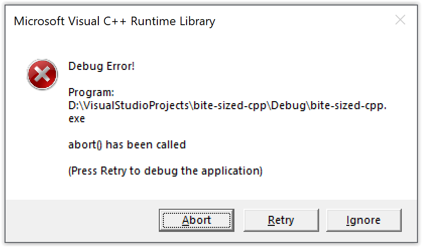

# #28. Best practices with exceptions (Part 3)

This time, the best practices are about the best way to write multiple `catch` blocks for exceptions; and also just the fact that it *is* a good idea to handle exceptions.

You can chain multiple `catch` blocks (exception handlers) together, each handling a different exception type.

```cpp
#include <stdexcept>
try
{
    // Guarded code
}
catch (std::logic_error const& /* ex */)
{
    // Take appropriate action
}
catch (std::runtime_error const& /* ex */)
{
    // Take appropriate action
}
catch (std::exception const& /* ex */)
{
    // Take appropriate action
}
catch (...)
{
    // Take appropriate action
}
```

When an exception is thrown, that exception is caught by the first handler that matches the type (or some base type) of the exception. If an exception could logically be caught by more than one exception handler, then you should order them so that the most specific (most derived) hander appears earlier.

In the example above, the handler for [**std::logic_error**](https://docs.microsoft.com/cpp/standard-library/logic-error-class) and [**std::runtime_error**](https://docs.microsoft.com/cpp/standard-library/runtime-error-class) can actually appear in either order, since they're both derived from [**std::exception**](https://docs.microsoft.com/cpp/standard-library/exception-class). But they must both appear before the handler for **std::exception**.

As you can see above, the last handler has an ellipsis (…) as its parameter. This is the default handler, and it's capable of catching any type of exception. Since it's the most general possible handler, we put it last so that it catches anything not caught by earlier handlers.

Remember that a thrown exception *has to be caught*. Program execution stops if an exception is thrown but not handled. Here's how that looks.



As we've already mentioned, C++ doesn't have C#'s `finally` construct. We'll find out why not next time.

|Prev|Next|Contents|
|-|-|-|
|[#27. Best practices with exceptions (Part 2)](027.md)|[#29. Why doesn't C++ have a `finally` construct? (Part 1)](029.md)|[Bite-sized C++](../README.md)|
