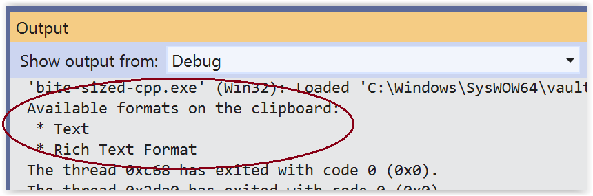

# #50. More formatted output using streams (Part 2)

Here's how to call the **BuildClipboardFormatsOutputString** function that we saw last time. If you're following along, then add the code below inside your **main** function.

```cppwinrt
std::wstring clipboardFormatsOutputString{ BuildClipboardFormatsOutputString() };
std::wcout << clipboardFormatsOutputString;
::OutputDebugStringW(clipboardFormatsOutputString.c_str());
```

There's nothing much new there, except that we call the [**wstring::c_str**](https://docs.microsoft.com/cpp/standard-library/basic-string-class#c_str) function to retrieve a C-style null-terminated string. That's what [**OutputDebugStringW**](https://docs.microsoft.com/windows/win32/api/debugapi/nf-debugapi-outputdebugstringw) expects.

And there's uniform initialization again, initializing *clipboardFormatsOutputString*.

You can now select some text and copy it to the clipboard. Then build and run the app under the debugger (**Start Debugging (F5)** in [Visual Studio](https://visualstudio.microsoft.com/downloads/)).

You'll be able to see the output both in the console and in Visual Studio's [**Output** window](https://docs.microsoft.com/visualstudio/ide/reference/output-window). Here's what that output looks like.



|Prev|Next|Contents|
|-|-|-|
|[#49. More formatted output using streams (Part 1)](049.md)|[#51. The **std::for_each** algorithm (Part 1)](051.md)|[Bite-sized C++](../README.md)|
