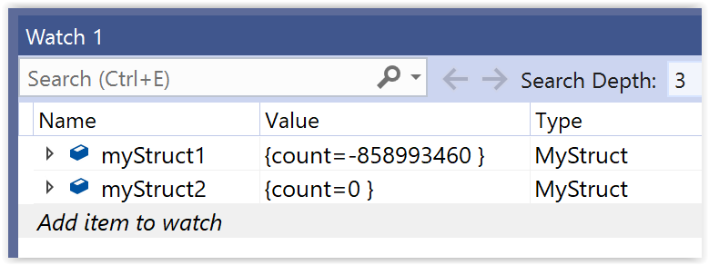

# #55. Zero-initializing a struct

Consider this simple structure.

```cpp
struct MyStruct
{
    int Count;
};
```

Notice that the data member named *Count* is not initialized. And here are two instances of **MyStruct**.

```cpp
int main()
{
    MyStruct myStruct1;
    MyStruct myStruct2{};
}
```

That first variable, *myStruct1*, is a problem. That's because its *Count* data member occupies uninitialized memory (therefore *myStruct1* as a whole is uninitialized). If you try to use *myStruct1* in a debug build, then you'll get a runtime error to that effect.

But *myStruct2* has that empty-pair-of-curly-brackets syntax. What that does is it zero-initializes the data members of *myStruct2*. If **MyStruct** had more than one data member, then that empty pair of curly brackets would zero-initialize *all* of those members.

And, just to reinforce the point, here's an illustration looking inside the contents of the uninitialized *myStruct1* (with its arbitrary, uninitialized value for *Count*), and inside the zero-initialized *myStruct2*.



|Prev|Next|Contents|
|-|-|-|
|[#54. The **std::for_each** algorithm (Part 2)](054.md)|[#56. Initializing a struct to *any* value](056.md)|[Bite-sized C++](../README.md)|
